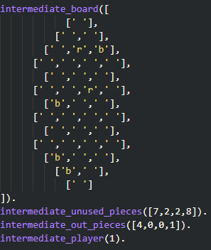
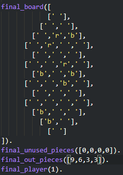
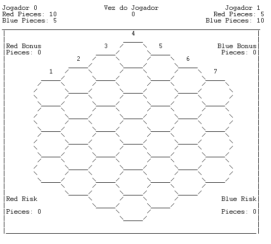

# PLOG_TP1_FINAL_T2_Gauss4

## Jogo: Gauss

| Name                          | Turma     | Number    | E-Mail               |
| ----------------------------- | --------- | --------- | -------------------- |
| Luís Miguel Afonso Pinto      |     2     | 201806206 | up201806206@fe.up.pt |
| Nuno Filipe Amaral Oliveira   |     2     | 201806525 | up201806525@fe.up.pt |

## Instalação e execuçaõ
Para além da instalação do SICStus Prolog 4.6 não é preciso instalar mais nada. Tendo os ficheiros todos com o código fonte é apenas necessário abrir o sicstus pela linha de comandos (sistemas UNIX) ou usando a GUI (sistemas Windows) e consultar o ficheiro 'game.pl' que consulta os restantes ficheiros necessários automaticamente. 

## Descrição do Jogo
O tabuleiro do jogo é hexagonal consistindo de 36 células também elas hexagonais:
>

As bordas do hexágono são mais escuras porque são chamadas de void. Os jogadores não podem colocar peças nestas zonas no entanto as peças podem chegar lá eventualmente devido às mecanicas do jogo quando uma peça é colocada no tabuleiro (explicado mais à frente). De resto, estas zonas não diferem funcionalmente das restantes exceto na recolha de peças pontuadas e no cáculo da pontuação (também explicado mais a baixo).

Cada jogador dispõe também duma zona de bónus, outra de risco para onde vão as peças depois de pontuadas e de 15 peças (10 da cor dele e 5 da cor do adversário). Um à vez os jogadores colocam uma peça da cor que desejarem no tabuleiro que como um íman atrai peças de cor diferente e afasta de cor igual que já estejam na área de jogo até bater noutra peça ou na borda/void (isto afeta apenas a primeira peça em cada uma das 6 direções). 

Se após uma jogada houver 4 ou mais peças adjacentes da mesma cor, o jogador dessa cor tem de as recolher e colocar numa das duas zonas, se a peça estiver num espaço void vai para a zona de risco e caso contrário vai para a zona de bónus. 

Quando não houver mais peças para jogar o jogo acaba e as que ficaram no tabuleiro permanecem lá dado que vão ser importantes para calcular as pontuações finais. 

As pontuações são calculadas da seguinte maneira:
- Cada peça na zona bónus vale 1 ponto.
- Se no fim do jogo um jogador tiver mais peças da sua cor na zona void do que o outro este terá de subtrair um ponto por cada peça que tem na zona de risco. 
- Depois destes cálculos feitos, o jogador com mais pontos ganha.
- Em caso de empate é considerado vencedor o jogador com menos peças da sua cor em zonas void.
- Se mesmo assim houver empate é considerado vencedor o jogador com menos peças na zona de risco.
- Se o empate persistir, por improvável que seja, ambos os jogadores são considerados vencedores.

Página oficial do jogo: https://nestorgames.com/#gauss_detail

Rulebook: https://nestorgames.com/rulebooks/GAUSS_EN.pdf

## Lógica do Jogo

### Representação Interna do Estado de Jogo

- O tabuleiro de jogo original tem 7 filas com 4 a 7 hexágonos pequenos de maneira a representar um hexágono maior. No entanto, para conseguirmos desenhar o tabuleiro como pretendido em PROLOG teremos de o desenhar na vertical (com 13 filas "intercaladas" cada uma com 1 a 4 hexágonos) o que não altera logística do jogo em si.

- As peças dos jogadores são representadas por uma lista de duas listas. A primeira lista representa as peças do jogador 0 e a segunda as peças do jogador 1. Cada elemento da lista de um jogador representa o numero de peças não usadas. [[PeçasVermelhas0,PeçasAzuis0],[PeçasVermelhas1,PeçasAzuis1]]

- Peças recolhidas serão guardadas de maneira idêntica às que ainda não foram jogadas só que em vez de jogadores temos área de risco e área de bónus.[[BonusVermelho,BonusAzul],[RiscoVermelho,RiscoAzul]]

- O jogador atual será guardado como um inteiro que terá o valor de 0 ou 1 para indicar o turno.

- O estado de jogo a cada instante é constituído pelo tabuleiro, as peças por jogar, as peças na zona de bónus e risco de cada jogador e finalmente de quem é a vez de colocar uma peça no tabuleiro.

- Internamente no tabuleiro ' ', 'r' e 'b' representam vazio, peça vermelha e peça azul, respetivamente. 

-  O tabuleiro, peças por jogar e peças na zonas de  recolha serão iniciados assim: 
>

-  Numa fase intermédia do jogo espera-se que haja algumas peças na área de jogo, possivelmente algumas nas zonas de recolha e obviamente as lista das peças por jogar terá numeros menores: 
>

-  O jogo acaba quando não houver mais peças para jogar e sendo assim o tabuleiro tanto pode estar completamente vazio como com várias peças. A segunda situação é a mais provavél porque as peças que ficarem na zona void no fim do jogo vão ser importantes para a atribuição dos pontos a cada jogador.
>

### Visualização do Estado de Jogo
O predicado responsável pela visualização do estado de jogo a cada instante recebe o tabuleiro, peças por jogar, peças recolhidas, o turno e um elemento extra que começa em 1 e vai sendo iterado para saber qual a fila a desenhar dado que desenhar um tabuleiro com espaços hexagonais com elementos ASCII é relativamente complexo. A cada fila remove-se a HEAD da cópia da lista do tabuleiro para se desenhar os valores certos no tabuleiro. 

Acima do tabuleiro será indicado o número de peças que cada jogador ainda dispõe para jogar. Para além disso, no meio dessa informação será escrito quem é a próxima jogada. 

Novamente dentro do tabuleiro, cada canto será identificado como zona de bónus ou risco de cada jogador e terá um inteiro que representa o número de peças efetivamente nessa zona. Este inteiro será atualizado quando for necessário mover uma peça do interior do tabuleiro para a respetiva zona.

O output deste predicado num estado inicial, intermédio e final seria respetivamente: 

>
>
>

### Lista de Jogadas Válidas
A listagem das jogadas válidas é obtida usando o predicado valid_moves(+GameState, +Player, -ListOfMoves). Este predicado através de um predicado ao auxiliar check_line([H|T], Row, List) que irá percorrer todas as linhas to tabuleiro e que por sua recorre ao predicado check_pos(Line,P,[H|T],List) para pesquisar cada coluna por uma célula vazia para a adicionar à lista de output.
 
### Execução de Jogadas
Primeiramente para que um jogador introduza uma jogada ser-lhe-á pedido à vez a cor da peça, a coluna e a linha da coluna, a contar de cima, em que pretende efetuar a jogada. Se por vários motivos a jogada especificada não for válida (tentar colocar no void, num espaço não vazio, etc) irá receber uma confirmação visual disso e terá que especificar outra jogada. Se tudo se confirmar o predicado move(+GameState,+Move,-NewGameState) é responsável por efetivamente colocar a peça no tabuleiro e tratar das mudanças todas necessárias ao mesmo. Assim vai percorrer o tabuleiro em cada uma das seis direções a partir da nova peça no tabuleiro até encontrar uma peça e atraí-la ou afastá-la da peça colocada. 

### Final do Jogo
O final do jogo é testado a cada jogada usando o predicado game_over(+GameState, -Winner) que vê se ainda há peças a jogar ou não. Se tal não e verificar calcula as pontuações finais recorrendo e declara o vencedor.

### Avaliação do Tabuleiro
Dado um estado de jogo, o predicado ​value(+GameState, +Player, -Value) determinado o seu valor para o Player indicado percorrendo o tabuleiro e dando o valor de 1 a cada peça mais 1 ponto por cada peça da mesma cor adjacente. No entanto se a peça avaliada estiver na zona void cada peça adjacente irá subtrair um ponto em vez de somar.

### Jogada do Computador
De entre todas as jogadas possíveis o computador irá usar o predicado choose_move(+GameState, +Player, +Level, -Move) para escolher a melhor para si guiando-se pela avaliação do estado de jogo em que cada jogada deixaria.

## Conclusão
Devido à estrutura do tabuleiro e às mecanicas do jogo tivemos bastantes dificuldades no aspeto de manipulação do estado de jogo pelo que tivemos que trabalhar constantemente com 2 posições em vez de 1: posição que o jogador introduz e a posição interna, o que complicou imenso cada predicado aumentando o numero de atributos.

## Bibliografia